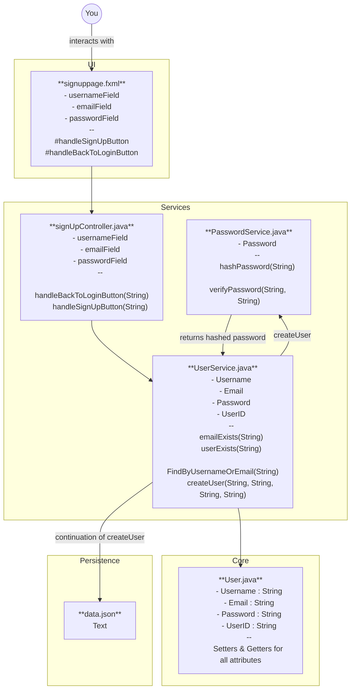

# MooseMate project

MooseMate is a Multimodule JavaFX application. The source code is located in the [moosemate](./moosemate/) folder, and its submodules are there as well.

The submodules are:
[core](./moosemate/core/)
[persistence](./moosemate/persistence/)
[rest](./moosemate/rest/)
[ui](./moosemate/ui/)

## Build, run and test

The project is built with Maven. 

~~~
cd moosemate
mvn clean install
mvn -pl ui javafx:run
~~~

The project is tested by: 

~~~
mvn clean test
~~~

mvn clean test will run TestFX tests as well as spotbugs and surefire.
to test only javaFX coverage in JaCoCo, run:

~~~
mvn test -pl ui -Dtest="*TestFX"
~~~

Due to NTNUs requirements for this task, we have to use TestFX, and TestFX is not out-of-the-box supported by current MacOS systems, so the ui tests are purely tested on Windows machines.

HTML-link to display test coverage is provided as an echo in the terminal before the build data.

## Dependencies

- Java (21)
- JavaFX (21)
- TestFX (4.0.18)
- JUnit 5 (5.12.2)
- Maven Surefire (3.12.1)
- Jackson (2.17.2)
- BCrypt (0.4)
- Mockito (5.7.0)
- JaCoCo (0.8.12)
- Spotbugs (4.9.5.0)
- Checkstyle (3.3.1)
- Spring Boot (3.1.5)

## Eclipse Che

[Open project in Eclipse Che](https://che.stud.ntnu.no/#https://git.ntnu.no/IT1901-2025-groups/gr2524)

## Architecture Diagram

The mermaid-constructed diagram above represents how a user would intervene and with which files it uses in order to create a user.
The yellow boxes also represent which module each file belongs to.

For further explanation see [technical-documentation.md](/docs/release2/technical-documentation.md)

## Documentation for release 3

Documentation is found in the [docs](./docs) folder.

- **[AI Tools](./docs/release3/ai-tools.md)** - Overview of AI tools used during development, including GitHub Copilot and their impact on productivity
- **[Challenges](./docs/release3/challenges.md)** - Technical challenges encountered during release 3 and solutions implemented
- **[Contribution](./docs/release3/contribution.md)** - Individual team member contributions and responsibilities throughout the project
- **[REST API Format](./docs/release3/rest-format.md)** - Complete REST API documentation including endpoints, request/response formats, and authentication
- **[Sustainability](./docs/release3/sustainability.md)** - Analysis of sustainable development practices including energy efficiency, version control, and testing strategies
- **[Teamwork](./docs/release3/teamwork.md)** - Team collaboration processes, workflow organization, and lessons learned
- **[Work Practices](./docs/release3/workpractices.md)** - Development methodologies, code review processes, and quality assurance practicess