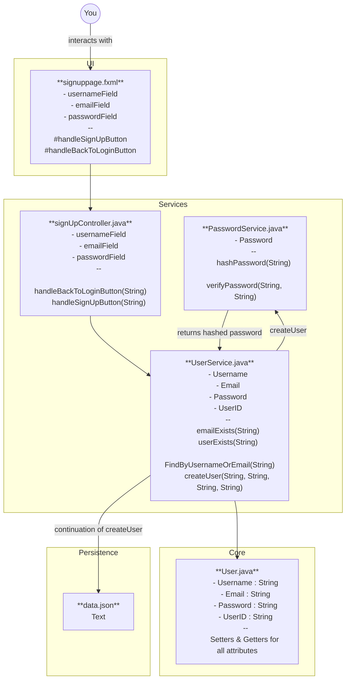

# MooseMate project

**MooseMate** is a **multimodule JavaFX application**.  
The source code is located in the [`moosemate`](./moosemate/) folder, which also contains its submodules:

- [core](./moosemate/core/)
- [persistence](./moosemate/persistence/)
- [rest](./moosemate/rest/)
- [ui](./moosemate/ui/)

## Build, run and test

The project is built with Maven in [moosemate](./moosemate/) folder. 

~~~
cd moosemate
mvn clean install
mvn -pl ui javafx:run
~~~

The project is tested by: 

~~~
mvn clean test
~~~

mvn clean test will run TestFX tests as well as spotbugs and surefire.
to test only javaFX coverage in JaCoCo, run:

~~~
mvn test -pl ui -Dtest="*TestFX"
~~~

HTML-link to *display test coverage* is provided as an echo in the terminal before the build data.

## Shortcuts

For simplicity, we have created startup scripts that run both the backend and frontend with a single command. **Make sure you are in the root folder before running the scripts.**
~~~
run-app.bat for **Windows**  
run-app.sh for **Mac/Linux**
~~~

We have also included a desktop shortcut with an icon, allowing the user to start **MooseMate** by double-clicking the icon.  
It can be saved to any preferred location through the Windows “Browse” dialog during installation.
~~~
create-windows-shortcut.bat for **Windows**  
create-mac-launcher for **Mac/Linux**
~~~

## Dependencies

Core and frameworks
- Java (21)
- JavaFX (23.0.1)
- Spring Boot (3.4.0)
- Spring Framework (6.2.0)

Testing
- TestFX (4.0.18)
- JUnit 5 (5.12.2)
- Hamcrest (3.0)
- Mockito (5.7.0)
- JaCoCo (0.8.12)
- Spotbugs (4.9.5.0)
- Checkstyle (3.3.1)

Utilities and libraries
- Maven Surefire (3.12.1)
- Jackson (2.18.1)
- BCrypt (0.4)

## Eclipse Che

[Open project in Eclipse Che](https://che.stud.ntnu.no/#https://git.ntnu.no/IT1901-2025-groups/gr2524)

test
[Open project in Eclipse Che](https://che.stud.ntnu.no/#https://git.ntnu.no/IT1901-2025-groups/gr2524?branch=60/Update-documentation)
## Documentation

Documentation is found in the [docs](./docs) folder.

## Architecture Diagram

The mermaid-constructed diagram above represents how a user would intervene and with which files it uses in order to create a user.
The yellow boxes also represent which module each file belongs to.

For further explanation see [technical-documentation.md](/docs/release2/technical-documentation.md)

