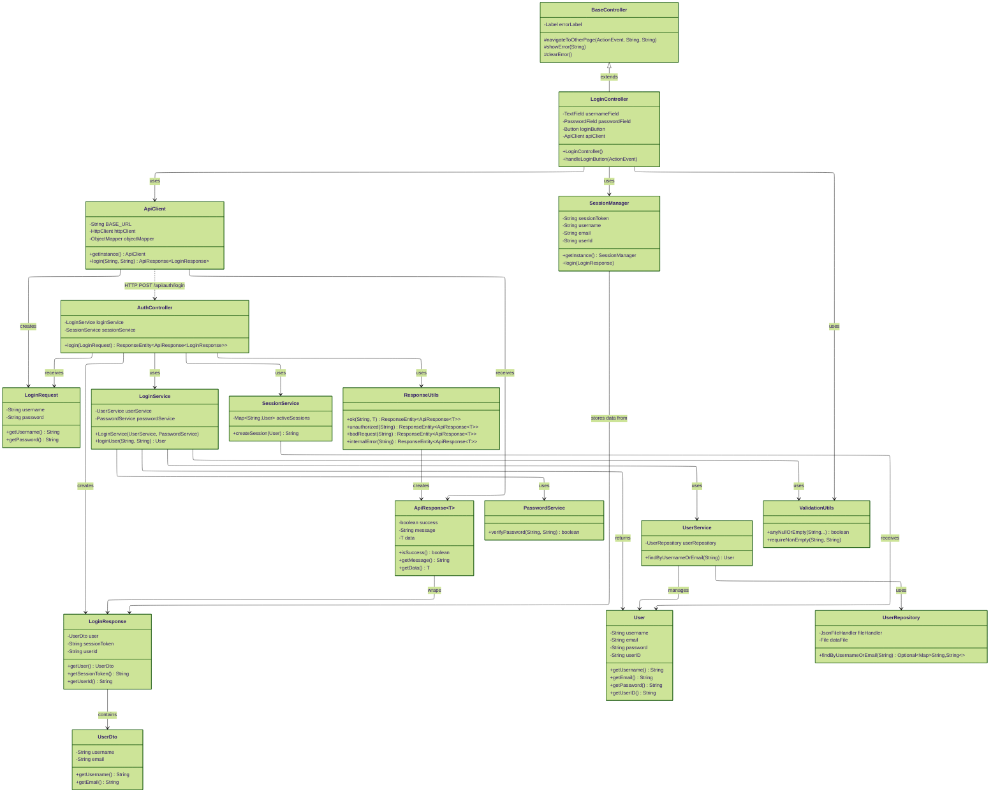

# Login Class Diagram

This diagram illustrates the class structure and relationships involved in the login functionality of the MooseMate application.

```mermaid
---
config:
  theme: forest
  layout: elk
---
classDiagram
    class BaseController {
        -Label errorLabel
        #navigateToOtherPage(ActionEvent, String, String)
        #showError(String)
        #clearError()
    }
    class LoginController {
        -TextField usernameField
        -PasswordField passwordField
        -Button loginButton
        -ApiClient apiClient
        +LoginController()
        +handleLoginButton(ActionEvent)
    }
    class ApiClient {
        -String BASE_URL
        -HttpClient httpClient
        -ObjectMapper objectMapper
        +getInstance() ApiClient
        +login(String, String) ApiResponse~LoginResponse~
    }
    class SessionManager {
        -String sessionToken
        -String username
        -String email
        -String userId
        +getInstance() SessionManager
        +login(LoginResponse)
    }
    class ApiResponse~T~ {
        -boolean success
        -String message
        -T data
        +isSuccess() boolean
        +getMessage() String
        +getData() T
    }
    class LoginRequest {
        -String username
        -String password
        +getUsername() String
        +getPassword() String
    }
    class LoginResponse {
        -UserDto user
        -String sessionToken
        -String userId
        +getUser() UserDto
        +getSessionToken() String
        +getUserId() String
    }
    class UserDto {
        -String username
        -String email
        +getUsername() String
        +getEmail() String
    }
    class AuthController {
        -LoginService loginService
        -SessionService sessionService
        +login(LoginRequest) ResponseEntity~ApiResponse~LoginResponse~~
    }
    class LoginService {
        -UserService userService
        -PasswordService passwordService
        +LoginService(UserService, PasswordService)
        +loginUser(String, String) User
    }
    class PasswordService {
        +verifyPassword(String, String) boolean
    }
    class SessionService {
        -Map~String,User~ activeSessions
        +createSession(User) String
    }
    class UserService {
        -UserRepository userRepository
        +findByUsernameOrEmail(String) User
    }
    class User {
        -String username
        -String email
        -String password
        -String userID
        +getUsername() String
        +getEmail() String
        +getPassword() String
        +getUserID() String
    }
    class UserRepository {
        -JsonFileHandler fileHandler
        -File dataFile
        +findByUsernameOrEmail(String) Optional~Map~String,String~~
    }
    class ValidationUtils {
        +anyNullOrEmpty(String...) boolean
        +requireNonEmpty(String, String)
    }
    class ResponseUtils {
        +ok(String, T) ResponseEntity~ApiResponse~T~~
        +unauthorized(String) ResponseEntity~ApiResponse~T~~
        +badRequest(String) ResponseEntity~ApiResponse~T~~
        +internalError(String) ResponseEntity~ApiResponse~T~~
    }
    BaseController <|-- LoginController : extends
    LoginController --> ApiClient : uses
    LoginController --> SessionManager : uses
    LoginController --> ValidationUtils : uses
    ApiClient --> LoginRequest : creates
    ApiClient --> ApiResponse : receives
    SessionManager --> LoginResponse : stores data from
    ApiResponse --> LoginResponse : wraps
    LoginResponse --> UserDto : contains
    ApiClient ..> AuthController : HTTP POST /api/auth/login
    AuthController --> LoginRequest : receives
    AuthController --> ResponseUtils : uses
    AuthController --> LoginResponse : creates
    AuthController --> LoginService : uses
    AuthController --> SessionService : uses
    LoginService --> UserService : uses
    LoginService --> PasswordService : uses
    LoginService --> ValidationUtils : uses
    LoginService --> User : returns
    SessionService --> User : receives
    UserService --> User : manages
    UserService --> UserRepository : uses
    ResponseUtils --> ApiResponse : creates
```
