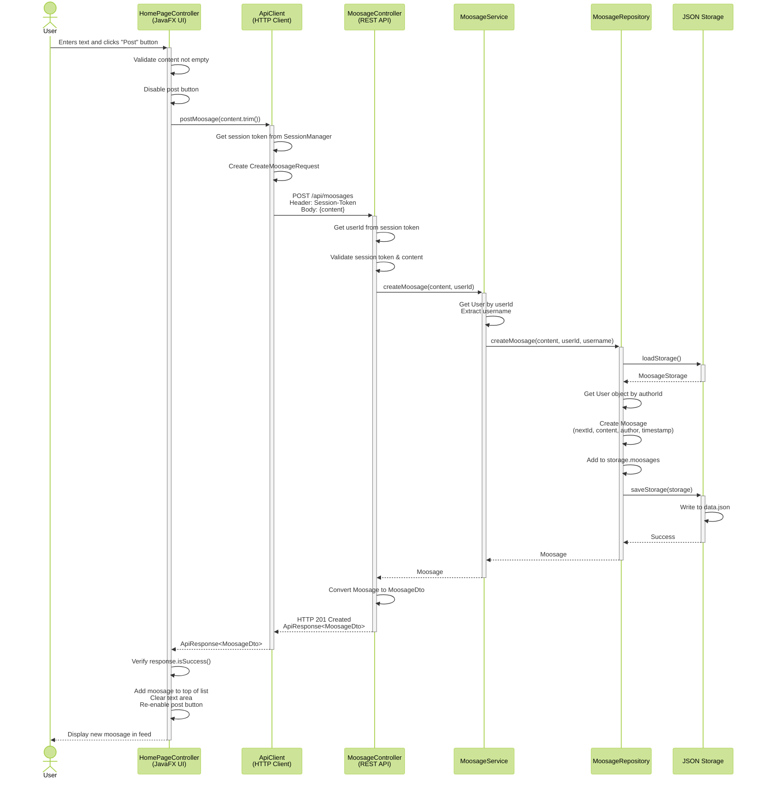

# Post Moosage Sequence Diagram

This diagram illustrates the sequence of interactions when a user creates and posts a moosage in the MooseMate application.

```mermaid
---
config:
  theme: forest
---
sequenceDiagram
    actor User
    participant UI as HomePageController<br/>(JavaFX UI)
    participant ApiClient as ApiClient<br/>(HTTP Client)
    participant REST as MoosageController<br/>(REST API)
    participant Service as MoosageService
    participant Repo as MoosageRepository
    participant Storage as JSON Storage
    User->>+UI: Enters text and clicks "Post" button
    UI->>UI: Validate content not empty
    UI->>UI: Disable post button
    UI->>+ApiClient: postMoosage(content.trim())
    ApiClient->>ApiClient: Get session token from SessionManager
    ApiClient->>ApiClient: Create CreateMoosageRequest
    ApiClient->>+REST: POST /api/moosages<br/>Header: Session-Token<br/>Body: {content}
    REST->>REST: Get userId from session token
    REST->>REST: Validate session token & content
    REST->>+Service: createMoosage(content, userId)
    Service->>Service: Get User by userId<br/>Extract username
    Service->>+Repo: createMoosage(content, userId, username)
    Repo->>+Storage: loadStorage()
    Storage-->>-Repo: MoosageStorage
    Repo->>Repo: Get User object by authorId
    Repo->>Repo: Create Moosage<br/>(nextId, content, author, timestamp)
    Repo->>Repo: Add to storage.moosages
    Repo->>+Storage: saveStorage(storage)
    Storage->>Storage: Write to data.json
    Storage-->>-Repo: Success
    Repo-->>-Service: Moosage
    Service-->>-REST: Moosage
    REST->>REST: Convert Moosage to MoosageDto
    REST-->>-ApiClient: HTTP 201 Created<br/>ApiResponse<MoosageDto>
    ApiClient-->>-UI: ApiResponse<MoosageDto>
    UI->>UI: Verify response.isSuccess()
    UI->>UI: Add moosage to top of list<br/>Clear text area<br/>Re-enable post button
    UI-->>-User: Display new moosage in feed
```
