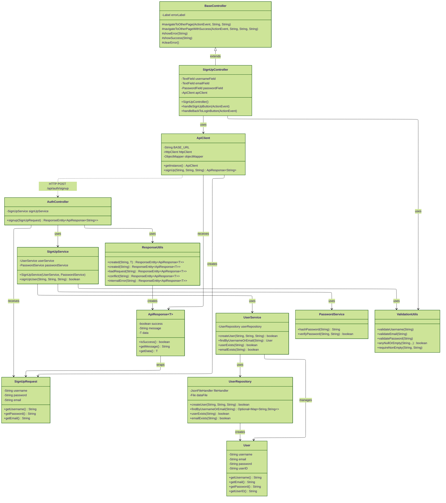

# Sign Up Class Diagram

This diagram illustrates the class structure and relationships involved in the user sign-up functionality of the MooseMate application.

```mermaid
---
config:
  theme: forest
  layout: elk
---
classDiagram
    class BaseController {
        -Label errorLabel
        #navigateToOtherPage(ActionEvent, String, String)
        #navigateToOtherPageWithSuccess(ActionEvent, String, String, String)
        #showError(String)
        #showSuccess(String)
        #clearError()
    }
    class SignUpController {
        -TextField usernameField
        -TextField emailField
        -PasswordField passwordField
        -ApiClient apiClient
        +SignUpController()
        +handleSignUpButton(ActionEvent)
        +handleBackToLoginButton(ActionEvent)
    }
    class ApiClient {
        -String BASE_URL
        -HttpClient httpClient
        -ObjectMapper objectMapper
        +getInstance() ApiClient
        +signUp(String, String, String) ApiResponse~String~
    }
    class ApiResponse~T~ {
        -boolean success
        -String message
        -T data
        +isSuccess() boolean
        +getMessage() String
        +getData() T
    }
    class SignUpRequest {
        -String username
        -String password
        -String email
        +getUsername() String
        +getPassword() String
        +getEmail() String
    }
    class AuthController {
        -SignUpService signUpService
        +signup(SignUpRequest) ResponseEntity~ApiResponse~String~~
    }
    class SignUpService {
        -UserService userService
        -PasswordService passwordService
        +SignUpService(UserService, PasswordService)
        +signUpUser(String, String, String) boolean
    }
    class UserService {
        -UserRepository userRepository
        +createUser(String, String, String) boolean
        +findByUsernameOrEmail(String) User
        +userExists(String) boolean
        +emailExists(String) boolean
    }
    class PasswordService {
        +hashPassword(String) String
        +verifyPassword(String, String) boolean
    }
    class User {
        -String username
        -String email
        -String password
        -String userID
        +getUsername() String
        +getEmail() String
        +getPassword() String
        +getUserID() String
    }
    class UserRepository {
        -JsonFileHandler fileHandler
        -File dataFile
        +createUser(String, String, String) boolean
        +findByUsernameOrEmail(String) Optional~Map~String,String~~
        +userExists(String) boolean
        +emailExists(String) boolean
    }
    class ValidationUtils {
        +validateUsername(String)
        +validateEmail(String)
        +validatePassword(String)
        +anyNullOrEmpty(String...) boolean
        +requireNonEmpty(String, String)
    }
    class ResponseUtils {
        +created(String, T) ResponseEntity~ApiResponse~T~~
        +created(String) ResponseEntity~ApiResponse~T~~
        +badRequest(String) ResponseEntity~ApiResponse~T~~
        +conflict(String) ResponseEntity~ApiResponse~T~~
        +internalError(String) ResponseEntity~ApiResponse~T~~
    }
    BaseController <|-- SignUpController : extends
    SignUpController --> ApiClient : uses
    SignUpController --> ValidationUtils : uses
    ApiClient --> SignUpRequest : creates
    ApiClient --> ApiResponse : receives
    ApiResponse --> SignUpRequest : wraps
    ApiClient ..> AuthController : HTTP POST /api/auth/signup
    AuthController --> SignUpRequest : receives
    AuthController --> ResponseUtils : uses
    AuthController --> SignUpService : uses
    SignUpService --> UserService : uses
    SignUpService --> PasswordService : uses
    SignUpService --> ValidationUtils : uses
    UserService --> User : manages
    UserService --> UserRepository : uses
    UserRepository --> User : creates
    ResponseUtils --> ApiResponse : creates
```
