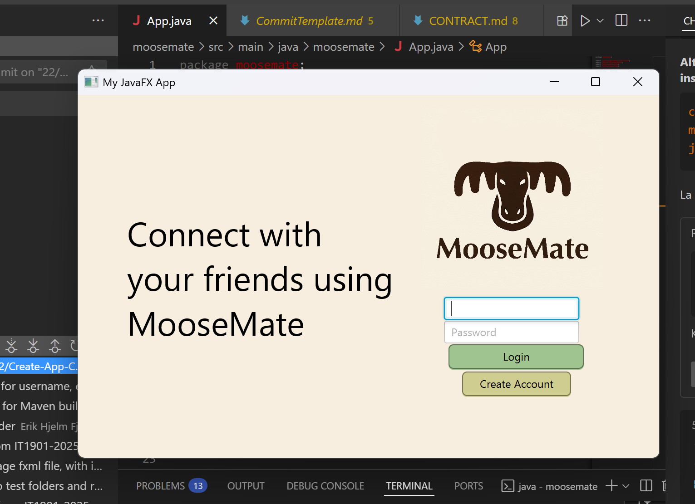

# MooseMate

## Description
MooseMate is a simple social media app where the user can create a profile, add friends and post messages in the feed, so called "moosages".

## User Stories

### User Story 1: User Registration
As a new user I want to create an account so that I can join the MooseMate forum.

- I can enter a unique username (max 20 characters, no spaces)
- I can provide a valid email address
- I can create a secure password (min 8 characters, contains letters and numbers)
- The system validates all input fields before creating my account
- I receive confirmation when my account is successfully created

### User Story 2: Logging in
As an already existing member of the MooseMate forum, I want to log in with username/email and password.

## Screenshot

