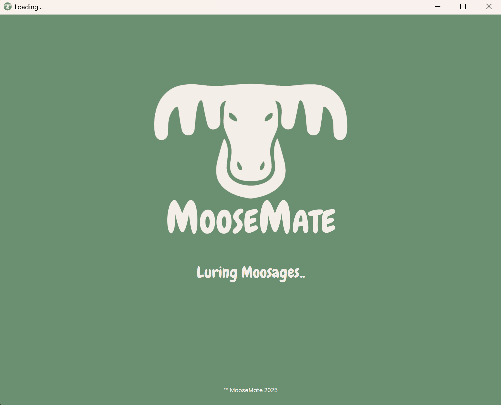
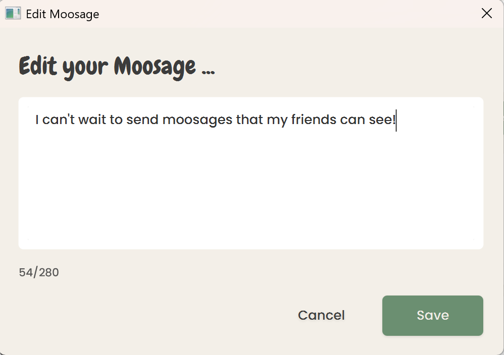

# MooseMate

## Description
MooseMate is a simple social media app where the user can create a profile and post messages in the feed, so called "moosages". Every profile is conncted to the same public forum.
Every profile is able to like and unlike posts, as well as edit and delete posts made by the user itself.

## User Stories

The user stories act as foundation for the issues provided in the project board. We worked in Agile Scrum with a high-granularity backlog, focusing on many small issues instead of a few large ones.

### 1) User Registration and login
As a new user I want to create an account so that I can join the MooseMate forum.

- I can enter a unique username (max 20 characters, no spaces)
- I can provide a valid email address
- I can create a secure password (min 8 characters, contains letters and numbers)
- The system validates all input fields before creating my account
- I receive confirmation when my account is successfully created

As now a member of the MooseMate forum, I am able to log in with the username/email and password I just set for myself.

### 2) Posting a Moosage
As an already existing member of the MooseMate forum, I want to log in with username/email and password.

After logging in, I am met with a prompt saying "Whats between your antlers, (my username)"
If I enter an input here, and hit the "Moose it" button, I can post my first Moosage to the MooseMate forum.

## Illustrating screenshots

### Login page

### Sign up page

### Loading screen

### Homepage

### Edit Moosage

